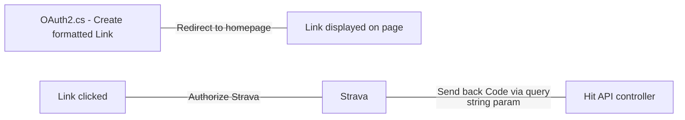

# OC.Strava
WIP - Strava API library for .Net

`Code` is the bearertoken from Strava

```mermaid
%%{init: {"flowchart": {"htmlLabels": false}} }%%
flowchart LR
    markdown["`OAuth2.cs - Create formatted Link`"]
    newLines["`Link displayed on page`"]
    markdown ---|Redirect to homepage| newLines

    A[Link clicked] ---|Authorize Strava| B[Strava]
    B ---|Send back Code via query string param| C["Hit API controller"]
```
